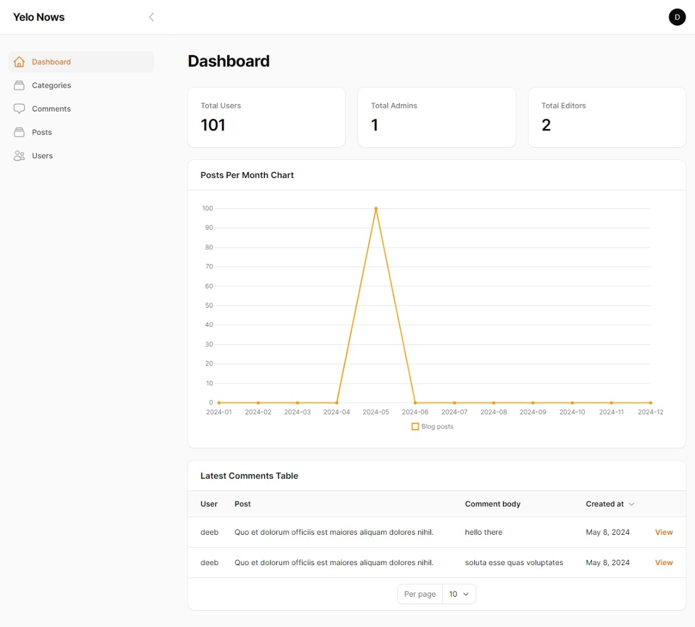

<h3>building blog web site  </h3>

Using laravel 11, Jetstream , tailwind css ,livewire v3 ,filament v3
  
<h3>Guset Section</h3>  

Welcome page
  
 
<h3>Blog page</h3>  
 
<h3>Post page</h3>  
 
<h3>Authentication Section</h3>  

Register page
  
 
<h3>Profile</h3>  
 
<h3>Auth User Section</h3>  

Welcome page
  
 
<h3>Blog page</h3>  
 
<h3>Post page</h3>  
 
<h3>Admin Section</h3>  

Admin panel
  
 
<h3>Categories index page</h3>  
 
<h3>Category Edit page</h3>  
 
<h3>Comments page</h3>  
 
<h3>Posts index page</h3>  
 
<h3>Post Edit page</h3>  
 
<h3>Users index page</h3>  
 

